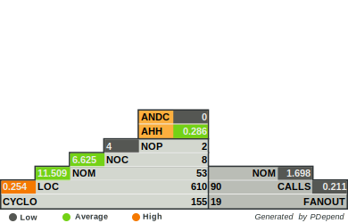

YAWL - Yet another wildcard library
===================================

This is a library with classes for any wildcard implementation that finds pattern with * (asterisk) and ? (query) token.

Problem
-------

Without regular expression extension (named `ext-pcre` - before PHP 5.3) you have no wildcard support within PHP.

See https://www.php.net/manual/en/pcre.installation.php.

The known wildcard behavior (see [Wildcard character (@Wikipedia)](https://en.wikipedia.org/wiki/Wildcard_character))
is limited for a good implementation.

A small remedy?

We need a kind of "compiled" and "cached" pattern. The implementation of regular expression like `preg_match` has a
huge performance. We lost these advantage as of PHP 7.0, because of just-in-time compiled pcre pattern!

Table of content
----------------

1. Benchmark
2. Wildcard variants
3. Possible valid pattern
4. Invalid pattern
5. Escaping 
6. Repeating phrases
7. Caching
8. Wish list
9. Appendix

API:

1. [Matcher (for use of single calls)](Documentation/WildcardMatcher.md)
2. [Performer (for use of multiple calls)](Documentation/WildcardPerformer.md)
3. [Converter (for use of regular expression)](Documentation/WildcardConverter.md)

Benchmark
---------

When we benchmark several methods to match a fitting phrase (1000 random strings), we have a good results without
"regular expressions":

*Single Byte:*

| Benchmark           | Time       | Reference | Difference  |   
|---------------------|------------|:---------:|:-----------:|
| `WildcardPerformer` | 0.00353789 |   100 %   | -           |
|        `preg_match` | 0.01223898 |    71 %   | 71 %        |
|   `WildcardMatcher` | 0.01635289 |    25 %   | 78 %        |

*Multi Byte (like Unicode):*

| Benchmark           | Time       | Reference | Difference  |  
|---------------------|------------|:---------:|:-----------:|
| `WildcardPerformer` | 0.00660086 |   100 %   | -           | 
|     `mb_ereg_match` | 0.01290488 |    48 %   | 48 %        | 
|   `WildcardMatcher` | 0.03252506 |    60 %   | 79 %        | 
   

Internal PHP functions comparison
---------------------------------

| Function   | WildcardMatcher | WildcardPerformer | 
|------------|-----------------|-------------------|
| strlen     | 9               | 5 (-4)            |
| substr     | 5               | 4 (-1)            |
| strpos     | 5               | 1 (-4)            |
| chr        | 2               | 2 (0)             |
| Conditions | 57              | 13 (-44)          |
 

Wildcard variants
-----------------

| != character | == 1 character | >= 2 characters | Token          |
|--------------|----------------|-----------------|----------------|
|            0 |              0 |               0 | (invalid)      |
|            0 |              0 |               1 | ??... / ??...* |
|            0 |              1 |               0 | ?              |
|            0 |              1 |               1 | **             |
|            1 |              0 |               0 | (empty string) |
|            1 |              0 |               1 | ??** (draft)   |
|            1 |              1 |               0 | ?*             |
|            1 |              1 |               1 | *              |

Possible valid pattern
----------------------

        ??      (2 characters)
        ???*  (2-3 characters)

Invalid pattern
---------------

        ***
        ?**
        ?*?
        *?

                           
Escaping
--------

        \\
        \?
        \*

Please note of this escaping scenarios:

| Subject        | Pattern       | Explanation                                                                                                    |
|----------------|---------------|----------------------------------------------------------------------------------------------------------------|
| `search\\*`    | `*\\*`        | matches `search\ ` with wildcard, then matches escaped `*`                                                     |
| `search\\*`    | `*\\\\*`      | matches `search` with wildcard, then matches escaped `\ `, then matches `*` with wildcard                      |
| `search\\*`    | `*\\\\\\*`    | matches `search` with wildcard, then matches escaped `\ `, then matches escaped `*`                            |
| `search\\*`    | `*\\\\\\\\*`  | matches `search` with wildcard, then matches escaped `\ `, then not matches escaped `\ ` - ignore rest of `*`  |

Further explanation:

| programmatic   | internal  | after escaping |
|----------------|-----------|----------------|
| ` \\ `         | ` \ `     | ` \ `          |
| ` \\\\ `       | ` \\ `    | ` \ `          |

Repeating phrases
-----------------

The asterisk (`*`) has a problem finding the right position. If several identical phrases can be found in a string,
the search must take place in all positions to find the pattern.

     Search: *is?ue (where is "*is")
    Subject: this is an asterisk issue
     Founds:   ^  ^          ^   ^

The simplest solution is to break down the pattern recursively, but it should be not recursively.

Caching
-------

The regular expression extension has a caching and compiling strategy to improve performance. The second time the same
pattern is called, a tremendous increase in performance is achieved.

To help us to improve also performance, we use a simple key-value caching.

        protected array $cachedResults = [];

        public function match(string $subject): bool
        {
            return $this->cachedResults[$subject] ?? $this->cachedResults[$subject] = $this->computePhrases($subject, 0);
        }

This is not a preferred solution.

Wish list
---------

- Remove recursive call of `WildcardPerformer::computePhrases` (see [Wikipedia - Matching wildcards](https://en.wikipedia.org/wiki/Matching_wildcards))
- Remove of `StringFunctionMapper` (too slow)
- Combine Matcher and Performer (two advantages in one)
- Caching interface
- New pattern `??**` (0 or 2 characters) or `?????**` (0 or 5 characters)
- [Glob support](https://en.wikipedia.org/wiki/Glob_\(programming\))
    - Example: `[abcdef0123456789]`, `[0-9a-f]`, `[!a-z]`
    - Use in YAWL:
        - `[0-9a-f]?` (one times)
        - `[0-9a-f]?*` (zero or one times)
        - `[0-9a-f]*` (zero or N times)
        - `[0-9a-f]**` (one or N times)
        - `[0-9a-f]x` (one times then follows `x`)
        
        
Appendix
--------

Common Algorithms:
- [Wildcard matching algorithms by "Alessandro Cantatore"](http://xoomer.virgilio.it/acantato/dev/wildcard/wildmatch.html)

Non-recursive Algorithms:
- [Matching Wildcards: An Improved Algorithm for Big Data by "Kirk J. Krauss"](http://developforperformance.com/MatchingWildcards_AnImprovedAlgorithmForBigData.html)

Recursive Algorithms:
- [Compares a filename or pathname to a pattern by "Apple"](https://opensource.apple.com/source/Libc/Libc-167/gen.subproj/fnmatch.c.auto.html)
- [Stackoverflow - Recursive solutions for glob pattern matching by "Siler"](https://stackoverflow.com/questions/30823596/recursive-solutions-for-glob-pattern-matching)

## PDepend

- NOP - Number Of Packages
- NOC - Number Of Classes
- NOM - Number Of Methods
- LOC – Lines of Code
- CYCLO - Cyclomatic complexity
- CALLS - number of distinct function- and method-calls
- ANDC - Average Number of Derived Classes
- AHH - Average Hierarchy Height
